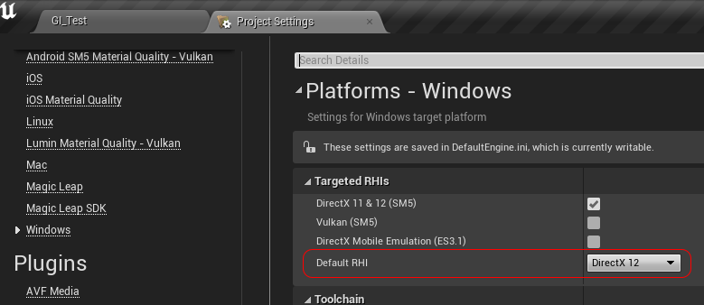
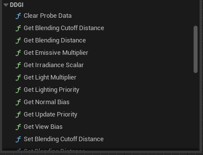
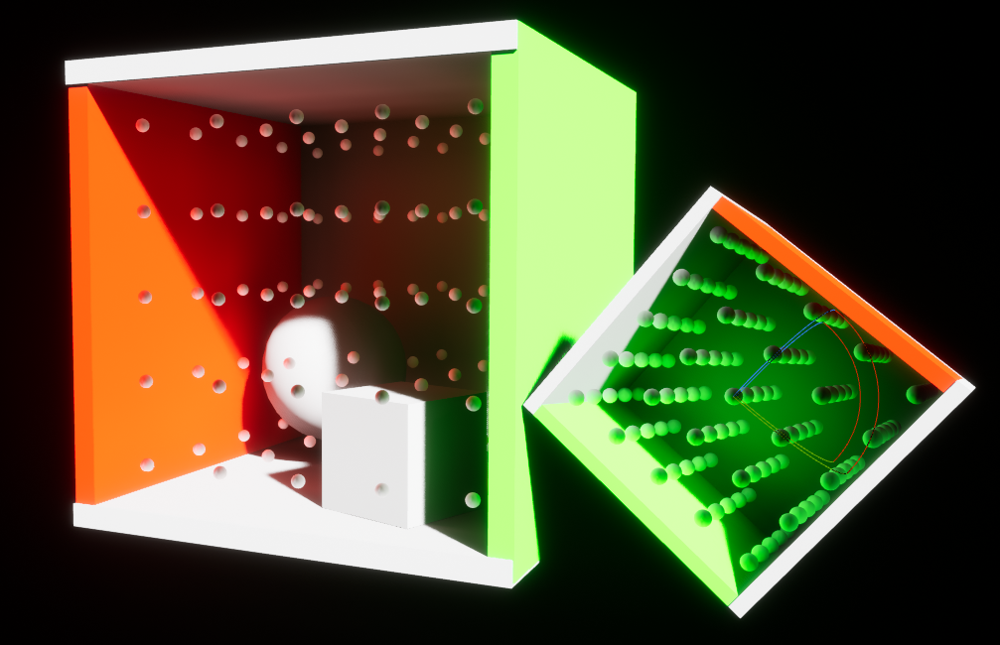
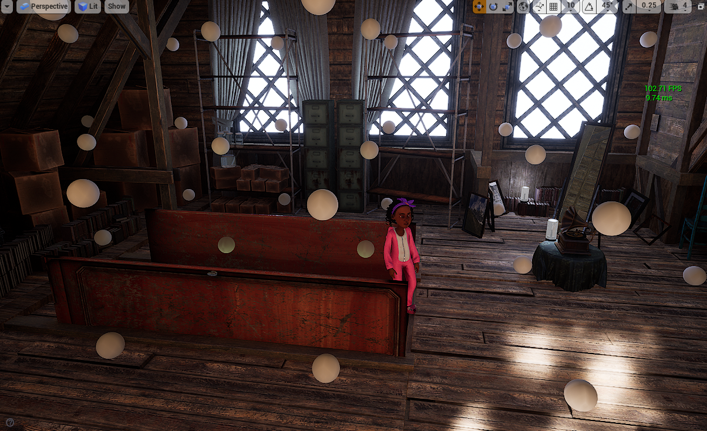
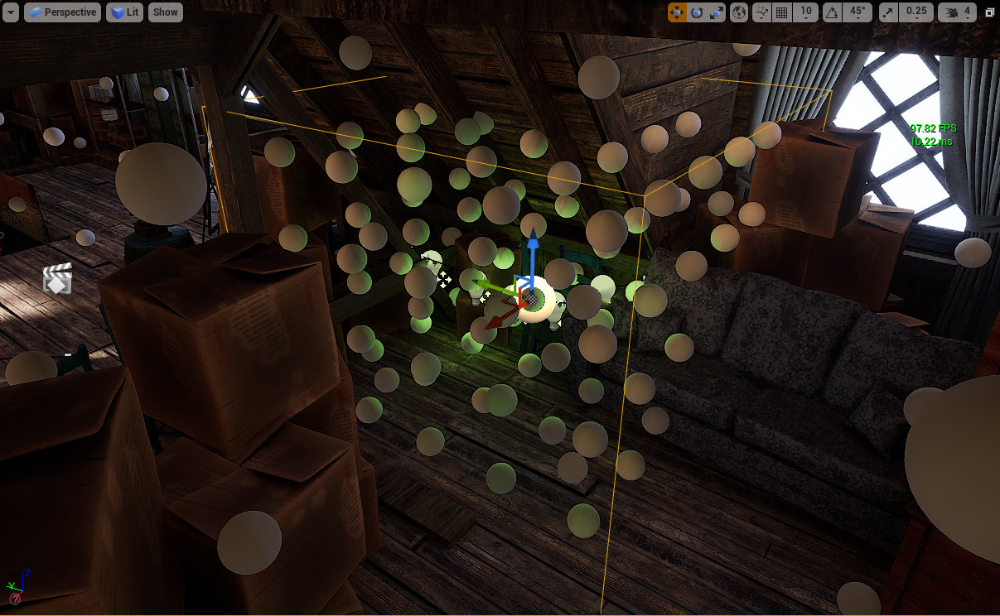
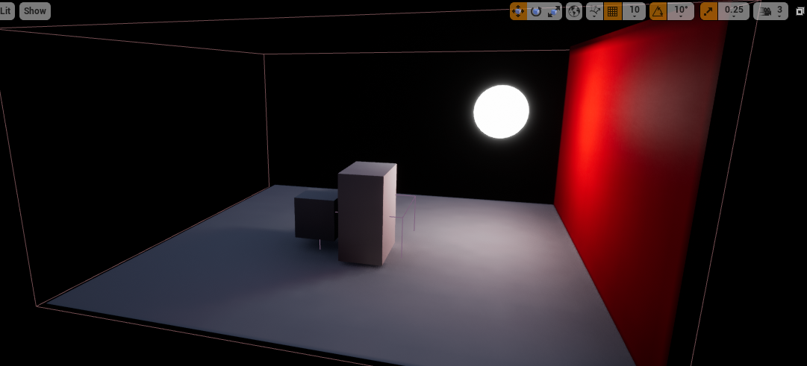
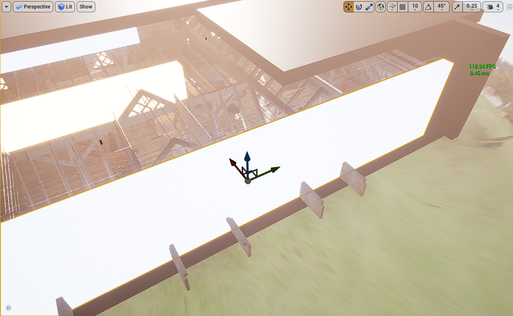
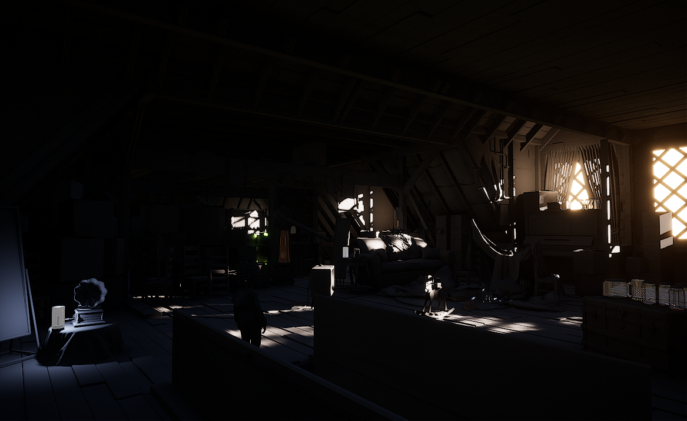
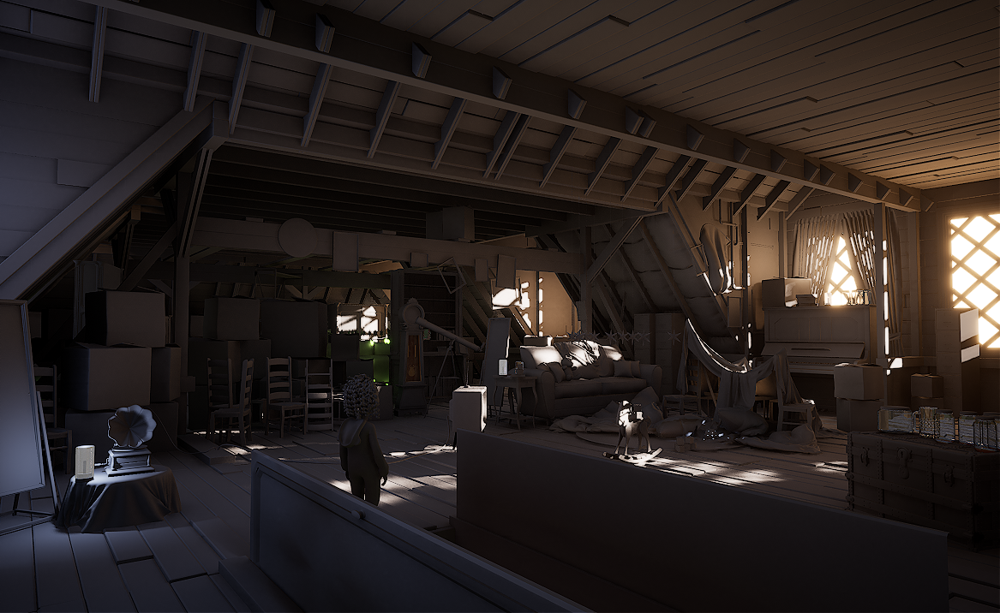

# RTXGI Unreal Engine Plugin

To bring the advantages of RTXGI to as many developers as possible, all RTXGI 1.1 features are now available in Unreal Engine through the RTXGI UE plugin.

To use the RTXGI UE plugin, you'll first need to meet the following software and hardware requirements:

**Software**

-   Windows 10 v1809 or higher.
-   The latest drivers for your GPU. NVIDIA drivers [are available here](http://www.nvidia.com/drivers).
-   Unreal Engine version 4.27 or 5.x

**Hardware**

 Any DXR enabled GPU. NVIDIA DXR enabled GPUs:
 -   Titan RTX
 -   RTX 3090, 3080 Ti, 3080, 3070 Ti, 3070, 3060 Ti, 3060, 3050
 -   RTX 2080 Ti, 2080 SUPER, 2080, 2070 SUPER, 2070, 2060 SUPER, 2060
 -   GTX 1660 Ti, 1660 SUPER, 1660
 -   GTX 1080 Ti, 1080, 1070, 1060 with at least 6GB of memory

| **Note** |
| -------- |
| **Problems, Feedback, and Bugs** If you encounter any problems, have feedback, or would like to report a bug, please contact: <rtxgi-support-service@nvidia.com> |

## Getting Started

**Set your project's default RHI to DirectX 12 and enable Ray Tracing** in the project settings. At this time, ray tracing requires DirectX 12 in Unreal Engine.

-   Go to *Project Settings&rarr;Platforms&rarr;Windows&rarr;Targeted RHIs&rarr;Default RHI* and select DirectX 12.
    -   Make sure the DirectX 11 & 12 (SM5) check box is also selected.

-   Go to *Project Settings&rarr;Engine&rarr;Rendering&rarr;Ray Tracing* and check the box next to Ray Tracing.
-   (Optional) Enable *Force No Precomputed Lighting* to avoid doubling lighting contributions (i.e. mixing RTXGI and precomputed indirect lighting).
    -   To disable precomputed lighting in the current level, select *World Settings&rarr;Lightmass&rarr;Force No Precomputed Lighting*.
    -   To disable precomputed lighting globally, disable *Project Settings&rarr;Engine&rarr;Rendering&rarr;Lighting&rarr;Allow Static Lighting*.

Next, navigate to the plugins area and **enable the RTX Global Illumination (RTXGI) plugin**.

-   In the editor, go to *Settings&rarr;Plugins*.
-   In the plugins dialog, go to *Built-In&rarr;Rendering*.
-   *Enable* the NVIDIA RTX Global Illumination plugin.

-   Restart the UE editor.
-   4.27:
    -   Set the `r.GlobalIllumination.ExperimentalPlugin` cvar to `1` to enable global illumination plugins (set in `.ini` files, on the console, or in blueprints).
-   5.x:
    -   Set the `r.DynamicGlobalIlluminationMethod` cvar to `4` to enable global illumination plugins (set in `.ini` files, on the console, or in blueprints). It can also be changed in the project settings. Under the rendering section, select **Plugin** for the **Dynamic Global Illumination Method**.

    -   As an alternative, in the postprocess settings set the Dynamic Global Illumination Method override to Plugin. The postprocess setting overrides the cvar.
-   Set the `r.RTXGI.DDGI` cvar to `1` to enable RTXGI (set in `.ini` files, on the console, or in blueprints).
-   Place DDGIVolume actors in the scene and to use RTX Global Illumination within the volume.
-   That's it. Go make something great with RTXGI! Learn more about RTXGI [Functionality](#functionality) and usage in the [Artist Overview](#artist-overview). 

## <a name="functionality">Functionality</a>

RTXGI implements the *Dynamic Diffuse Global Illumination (DDGI)* algorithm to compute diffuse global illumination. DDGI uses ray tracing to gather irradiance and distance data on a regular grid of probes. This is similar to existing irradiance probe solutions you may already be familiar with, but irradiance and distance calculations now occur in real-time. RTXGI probes temporally accumulate data and use a statistics-based method to resolve visibility and prevent light leaking.

**To use RTXGI in UE, place DDGIVolume actor(s) in the scene**. These volumes contain a grid of probes that RTXGI updates with ray tracing. One `DDGIVolume` is updated per frame in a weighted round robin fashion using the volume's **Update Priority** property.

Various properties of a `DDGIVolume` can be adjusted and these properties are discussed below.

### RTXGI Volume Properties

Dynamic indirect lighting is generated inside the volume with RTXGI. The `DDGIVolume` has many properties that can be tweaked (shown below on the right), but the default values should work well for many situations.

| GI Volume `DDGIVolume` Properties |
|-----------------------------------|
|  |

| Property                 | Description                                                                                                                                                                                                                                                                                                                                                                                                                                                                                     |
|--------------------------|-------------------------------------------------------------------------------------------------------------------------------------------------------------------------------------------------------------------------------------------------------------------------------------------------------------------------------------------------------------------------------------------------------------------------------------------------------------------------------------------------|
| Enable Volume            | Manually enables or disables the volume. |
| Update Priority          | A weighted round robin system is used to update volumes. **Volumes with higher update priority values are updated more often**. As a result, as more volumes are added to the scene, it will take longer for the system to update all volumes. |
| Lighting Priority        | A value that allows for custom prioritization of volumes. If there are multiple volumes in the view frustum at the same time, the densest volume will be selected and used to apply indirect lighting to nearby surfaces. **If you want to override this behavior, give the volume you want to use the lowest lighting priority value (and increase the lighting priority value of other volumes)**. |
| Blending Distance        | Specifies how the `DDGIVolume` blends at the edges of the volume, in world-space units. This is used to create faded areas at the edge of the volume and can be useful as an artistic control. For example, if you wanted vaulted ceilings at the top of a volume to have less light. |
| Blending Cutoff Distance | The distance from the edge of a volume at which it has zero weight (i.e. turns black or yields to an encompassing volume), in world-space units. Useful if you do not want a linear fade all the way to the edge. |
| Clear Probes             | Flushes current data stored in volume probes. |
| Runtime Static           | **Volumes marked as runtime static will store indirect lighting in probes at author-time and will not be updated dynamically during gameplay**. This can be used to decrease performance costs. For example, place a large static volume in the level with very sparse probes and mark it as runtime static to fill the scene with indirect lighting computed while in-editor. Then use smaller, denser DDGIVolumes for dynamic indirect lighting in places of interest at runtime |

| GI Probes ``DDGIVolume`` Properties |
|-------------------------------------|
|    |

| Property                        | Description                                                                                                                                                                                                                                                                                                                                                                                                                                                                                    |
|---------------------------------|------------------------------------------------------------------------------------------------------------------------------------------------------------------------------------------------------------------------------------------------------------------------------------------------------------------------------------------------------------------------------------------------------------------------------------------------------------------------------------------------|
| Rays Per Probe                  | Sets the number of rays traced per probe. Higher numbers of rays traced per probe increases image quality by producing more stable indirect illumination, but will have a higher performance cost. **In many cases, the default of 288 rays per probe works well**. |
| Probe Counts                    | Sets the number of probes placed on each axis of a `DDGIVolume`. High probe counts within a volume are usually not necessary. **We recommend probe grids arranged with probes every 2-3 meters**. Sparse probe grids often produce better visual results than dense probe grids, since dense probes grids localize the effect of each probe and can (at times) reveal the structure of the probe grid. **When in doubt, use the minimum number of probes necessary to get the desired result**. |
| Probe Max Ray Distance          | The maximum distance a probe ray can travel. No surfaces are hit past this distance. Reducing this value can increase performance in some scenarios. |
| Probe History Weight            | A value in the range \[0,1\] that affects the temporal accumulation of ray tracing results in probes. A value of 1 always uses the existing probe values and ignores the latest ray traced information. A value of 0 always uses the latest ray traced information and ignores all previous probe data. This property is best set to a value that balances the previous and latest ray traced data. **The default value of 0.97 works well in most cases**. |
| Automatic Probe Relocation      | Adjusts the position of probes every frame based on the surrounding world geometry. Probes are moved to locations that result in better lighting, instead of (for example) being positioned inside of walls or other objects. |
| Probe Min Frontface Distance    | The minimum distance allowed to a front facing triangle before Probe Relocation moves the probe. |
| Probe Backface Theshold         | The ratio of rays cast for a probe that may hit back facing triangles before Probe Relocation and State Classification assume the probes is inside of geometry. |
| Scroll Probes Infinitely        | Turns the volume into an **Infinite Scrolling Volume**. The volume becomes world axis-aligned and when the volume moves the probes on the outer-most edges of the volume are repositioned to the opposite end of the volume in the direction of movement ("scrolling" the volume like tank tread). With this approach, the majority of probes retain their position in world-space making for more temporally stable lighting results when the volume moves. |
| Visualize Probes			      | Shows probes of the current volume as grid of spheres. This is useful for debugging purposes. It is possible to change the visualization data or override probes visualization for all volumes from the project settings |
| Probe Distance Exponent         | An exponent used during visibility testing. A high value rapidly reacts to depth discontinuities but may cause banding. |
| Probe Irradiance Encoding Gamma | An exponent that perceptually encodes irradiance for faster light-to-dark convergence. |
| Probe Change Threshold          | A ratio used during probe radiance blending. Specifies a threshold to identify when large lighting changes occur. When the difference in the maximum color components between the previous and current irradiance is larger than this threshold, the hysteresis will be reduced. |
| Probe Brightness Threshold      | A threshold value used during probe radiance blending that determines the maximum allowed difference in brightness between the previous and current irradiance values. This prevents impulses from drastically changing a texel's irradiance in a single update cycle. |

| GI Lighting ``DDGIVolume`` Properties |
|---------------------------------------|
|      |

| Property                   | Description                                                                                                                                                                                                                                                                                          |
|----------------------------|------------------------------------------------------------------------------------------------------------------------------------------------------------------------------------------------------------------------------------------------------------------------------------------------------|
| Sky Light Type on Ray Miss | None/Raster/Ray Tracing - specifies which type of the sky light contributes to lighting computed by the ``DDGIVolume`` for rays that missed the scene's geometry. Outside of ``DDGIVolume`` you can control type of sky light with `r.RayTracing.SkyLight`. |
| View and Normal Bias       | Similar to shadow map biases, these properties help adjust for visibility artifacts. If you are seeing light or shadow leaking problems, adjust these bias values. **In general, the view bias value should be 4x larger than the normal bias**. |
| Light Multiplier           | Use this setting to artificially increase or decrease the GI lighting contribution from this volume. Note that this multiplier affects lighting contribution from emissive surfaces as well. |
| Emissive Multiplier        | Use this setting to artificially increase or decrease how much emissive contributes to the GI in this volume. |
| 10-bit Irradiance Scalar   | A \[0,1\] value that is used to scale lighting magnitudes before storage when using 10-bit irradiance texture formats. Scaled values are reconstituted after reading, allowing for larger irradiance values to be stored in 10-bit texture formats. This saves memory at the cost of some precision. |

### Blueprints Overview
RTXGI exposes several functionalities to Blueprints. This allows implementing logic using the blueprint editor for controlling different DDGI Volume properties in run-time. All functions are grouped under the 'DDGI' category as shown below:

| Blueprint Node              | Description |
|-----------------------------|---------------------------------------------------|
| Clear Probe Data            |  Flushes current data stored in volume probes. |
| Get ``Emissive Multiplier``, ``Irradiance Scalar``, ``Light Multiplier``, ``Update Priority``, ``Lighting Priority``, ``Blending Distance``, ``Blending Cutoff Distance``, ``View Bias``, ``Normal Bias``|  Retrieves the current value for the corresponding property. |
| Set ``Emissive Multiplier``, ``Irradiance Scalar``, ``Light Multiplier``, ``Update Priority``, ``Lighting Priority``, ``Blending Distance``, ``Blending Cutoff Distance``, ``View Bias``, ``Normal Bias`` |  Changes the value of the corresponding property. |
| Toggle Volume               |  Enable or disable the target volume. |
| Set Probes Visualization    |  Toggles probes visualization for the target volume. |

All blueprint functions are accessible through the ``DDGIVolume Component``. The Blueprint editor will automatically add the necessary ``DDGIVolume Component`` when calling a blueprint function on a ``DDGIVolume`` actor.

Several new console variables ("cvars") are available to use with RTXGI. These are described in the table below.

### RTXGI Console Variables

| Command                           | Options    | Description                                                                                                                                                                                                        |
|-----------------------------------|------------|--------------------------------------------------------------------------------------------------------------------------------------------------------------------------------------------------------------------|
| `r.RTXGI.DDGI`                    | 0, 1       | Toggles RTXGI on or off.                                                                                                                                                                                           |
| `r.RTXGI.DDGI.LightingPass.Scale` | 0.25 - 1.0 | Scale for the lighting pass resolution between 0.25 - 1.0 (value is clamped to this range).                                                                                                                        |
| `r.RTXGI.DDGI.ProbesTextureVis`   | 0, 1, 2    | Toggles probe visualization. This allows the user to see what the probes see from the camera's point of view. In mode 2, it shows ray misses in blue, ray hits in green and ray back face hits in red.             |
| `r.RTXGI.MemoryUsed`              | None       | Shows the summary and details of video memory being used by RTXGI in the output log.                                                                                                                               |
| `Vis DDGIProbesTexture`           | None       | Allows the user to see the texture from the `r.RTXGI.DDGI.ProbesTextureVis` command. This helps diagnose inaccuracies in the probes due to lighting or geometry not being configured to be visible to ray tracing. |
| `r.RTXGI.DDGI.StatVolume`         | Integer    | The index for which volume's STAT is displayed. Per volume stats are Num Samples, Probe Count X Y Z, and Num Rays.                                                                                                 |

### Project Settings

The RTXGI plugin has several settings in UE's project settings dialog.

- **Irradiance Bits** - by default, a 10-bit per color channel texture format is used to store probe irradiance. With extended radiance or very bright light sources, 10-bits may not be enough to properly represent the light's energy. The Irradiance texture's bit depth can be increased to 32-bits (using a RGBA32F texture format) to support extended radiance at the cost of increased memory use. Alteratively, use 10-bit irradiance and adjust the **Irradiance Scalar** option of a *DDGIVolume* to reduce lighting magnitudes before storage and scale them back up after reading. This saves memory at the cost of some precision.

- **Distance Bits** - by default, 16-bit floating point format is used to store distance (and distance squared) in a probe for use when determiniming occlusion. When distances are large, 16-bits may not be sufficient. The distance texture's bit depth can be increased to 32-bits for imrpoved precision.

- **Debug Probe Radius** - sets the radius of spheres, in world-space units, that are rendered when visualizing ``DDGIVolume`` probes.

- **Probe Update Ray Budget** - sets the maximum number of rays that may be cast when updating probes. 0 specifies an unlimited number of rays. An 8x8x8 volume using 288 rays per probe would specify 147,456 to fully update all probes each frame. One volume is updated each frame based on the volume's priority. A higher volume priority means the volume is updated more often. These settings make it possibe to place a ceiling on performance costs, while also controlling the proportion of ray updates (or amount of light lag) a volume recieves.

- **Probes Visualization** - by default visualized probes will show their irradiance, it is possible to visualize other modes including Hit Distance and Squared Hit Distance or disabling probes visualization for all volumes. In case of visualizing distances, please check the next property 'Probes Depth Scale' for controlling the distance range.

- **Probes Depth Scale** - when 'Probes Visualization' mode is set distance, it is possible to control this property to have better distance visualization on the probes.

- **Serialize Probes** - by default probes data is serialized in the .umap file. It is possible with this option to disable the serialization to have smaller map files on disk. Re-saving map with this option is disabled will wipe any existing data stored previously.

### Runtime Statistics

View RTXGI runtime statistics using `STAT RTXGI Performance`. All statistics are averages over time.

- **Total Number of Volumes** - total number of volumes in the scene
- **Selected Volume Index** - current index for the selected volume, set by `r.RTXGI.DDGI.StatVolume`
- **Num Samples (selected)** - Total number of samples generated by the selected volume. Note Num Samples is an estimate, as each ray generates 1 - (# of lights) samples, accurately calculated num samples would result in a severe performance hit.
- **Probe Count X (selected)** - Number of probes in the X dimension
- **Probe Count Y (selected)** - Number of probes in the Y dimension
- **Probe Count Z (selected)** - Number of probes in the Z dimension
- **Rays Per Probe (selected)** - Number of rays per probe
- **Samples Per Frame** - Total number of samples across all volumes
- **RTXGI Samples Per Millisecond** - Number of samples across all volumes per millisecond
- **RTXGI Samples Per Frame 60hz** - Number of samples accross all volumes possible at 60 fps, bounded to 0 when current fps is below 60.
- **RTXGI GPU Time (ms)** - Milliseconds of GPU time taken by RTXGI per frame
- **Total GPU Frametime (ms)** - Milliseconds of GPU time in total per frame
- **Frametime Without RTXGI (ms)** - Milliseconds of GPU time in total per frame sans RTXGI

**Limitations**
   - RTXGI does not work with UE's forward rendering path.
   - RTXGI lighting is not visible within UE's other ray traced effects (for example, ray traced reflections).
   - In UE 4.27, RTXGI will be overriden by RTGI when setting the `r.RayTracing.ForceAllRayTracingEffects` cvar to `1`. In order to show the RTXGI results, this cvar should be set to its default value `-1`

# <a name="artist-overview">Artist Overview</a>

RTXGI adds a high performance option to ray traced global illumination in UE. As implied by the name, RTXGI requires ray tracing to be enabled and the plugin to be active.

If ray tracing is not available, the RTXGI plugin loads probe textures that were previously stored to disk from a platform that has ray tracing (i.e. DirectX 12).

| **Note** |
| -------- |
| When ray tracing is not available, for example in DirectX 11 or Vulkan RHIs, ``DDGIVolumes`` can be used but operate in a static mode where the probes do not update at runtime.|

| **Note** |
| -------- |
|Probes temporally accumulate bounce lighting after a `DDGIVolume` is placed in the world.|

## RTXGI Volume Placement in UE

You can find the ``RTXGI DDGI Volume`` actor under **Volumes** (shown below) and place it in a level.

All of UE's native transform gizmos (translation, rotation, and scale) can be used to fit the volume to your geometry.

## Tips and Tricks

### Disable Lightmaps
By using RTXGI as the GI solution for the project, it is recommended to disable lightmaps support since you are replacing baked GI of Lightmass with dynamic infinite bounce GI from RTXGI. This helps reducing shader permutation thus speeding shader compilation. Additionally it helps saving some memory on static meshes since no additonal UV is required for baking lightmaps.

Disabling lightmap support can be done from the project settings by unchecking 'Allow Static Lighting'.

Regarding lightmap UV, this can be disabled from static mesh import options.

If the static mesh already has a lightmap UV generated, it can be deleted from the static mesh editor by unchecking 'Generate Lightmap UVs'.

### Sparse Probe Layouts Recommended

Relatively sparse probe grids are good practice for both high performance and quality results. As a starting point, we recommend setting probes about 2-3 meters apart from each other in a typical human-scale indoor scene. In large outdoor scenes, you can go much sparser and still get good results!

| **Note** |
| -------- |
|By design, RTXGI does **not** generate high frequency detail. Increasing probe density can help to an extent, but it won't produce precise or sharp lighting and shadow at any density. For high frequency details, use other forms of lighting such as RTAO, RT Skylight Shadows and/or RT rect lights.|

You can have multiple `DDGIVolumes` with varying probe densities. The system will always make use of the probes in the denser volume. You might do this if you need a more precision in a specific area. It may not take an expensive volume to achieve more precise sampling. The volume on the bottom right is a 5x5x5 `DDGIVolume` set to the default 288 rays per probe. A volume like this is relatively inexpensive and can help achieve the result you want!

| Recommended probe density | A higher density "detail" volume |
|---------------------------|----------------------------------|
|     | |

### Emissive Surfaces are Light Sources with RTXGI
One of the interesting features of RTXGI is the ability to consider emissive objects as light sources.

| **Note** |
| -------- |
|With emissive objects, raytracing is not limited to secondary rays. RTXGI considers the first ray hit as well. From an artist perspective, this means that emissive objects are considered as direct lighting source with shadow casting similar to parameteric lights of UE.|

|  |
|:--:|
| *Emissive sphere generating direct lighting and casting direct shadows* |

In this example of the NVIDIA Attic scene, there are large emissive meshes outside the windows to generate extra lighting.

|  |
|:--:|
| *Emissive meshes added outside the NVIDIA Attic to add lighting* |

_Any emissive surface can be a light source with RTXGI._ The larger and more physically available the light emissive mesh is to RTXGI probes, the greater the lighting contribution. Emissive surface values can also be turned up to generate more light.  With this approach, you might find it's better to switch from 10-bit irradiance to 32-bit irradiance, since this provides a more detailed range of light contributions. **32-bit irradiance should be used with caution** though, since it increases the memory cost 3x. Only enable 32-bit irradiance when absolutely necessary!

With RTXGI, it is now possible to light a scene with fewer point lights, spot lights, and/or area lights. Instead, you can rely on a combination of a few lights and emissive surfaces. This change will not only improve workflow and iteration time, but it can improve performance (due to fewer lights). You may find it's better to take on the small fixed cost of RTXGI instead of using many shadow casting lights. **Lighting a scene in this way is a different approach, but may produce a result that runs faster and is easier to create**.

**Here's a practical example:** 

Emissive meshes generate extra light without being a visible part of the scene. In UE, the emissive meshes can be marked as _only visible to ray tracing_. You can create "hidden" emissive meshes to generate extra illumination in areas where the visible mesh is too small to contribute on its own. To do this, make use of the `RayTracingQualitySwitch` node.

| Lighting from hidden emissive meshes | Hidden emissive meshes visualized |
|-----------------------------------------------|-----------------------------------|
|             |       |

### Make sure RTXGI is contributing light where you want

RTXGI doesn’t automatically make every surface brighter. It can require some fine tuning and the final result is a combination of your materials, overall lighting, postprocess settings, and other choices. A handy way to start developing your baseline for the global illumination contribution is to look at your scene in `Lightingonly` mode. `Lightingonly` is useful in this case because it displays all surfaces with a flat 50% gray color. When turning RTXGI on and off, you'll get a clear understanding of the true global illumination contribution being made by various lighting sources.

| **Note** |
| -------- |
|Even though the surfaces display as 50% gray, they still contribute color lighting and bounce, so you are getting a good look at what the lighting is doing.|

| Lightingonly mode, with direct lighting only | Lightingonly mode, with direct lighting and RTXGI |
|----------------------------------------------|---------------------------------------------------|
|                   |                       |

As you can imagine, dark surfaces don't reflect light well (very dark surfaces don't reflect light at all!). If your textures are dark (typically below the 50% brightness threshold), they will have less bounce light and a smaller global illumination contribution. This is not necessarily a bad result. If objects are meant to be very dark then the lighting is as intended and still physically based. Brighter surfaces will contribute more obvious bounce light (since they reflect it). Think of the visual look of a game like Mirror's Edge - with it's very bright and colorful surfaces and how much indirect bounce lighting it shows off.

### The Ultimate Tip

Think about your surfaces and how they relate to global lighting. If your goal is to make sure you have a lot of indirect light in your scene, even small value changes can have an impact on the final indirect lighting result. It may not take much of a shift in some cases to get the result you want.

[direct]: ../images/ue4-plugin/direct-only.png
[indirect]: ../images/ue4-plugin/direct+rtxgi.png